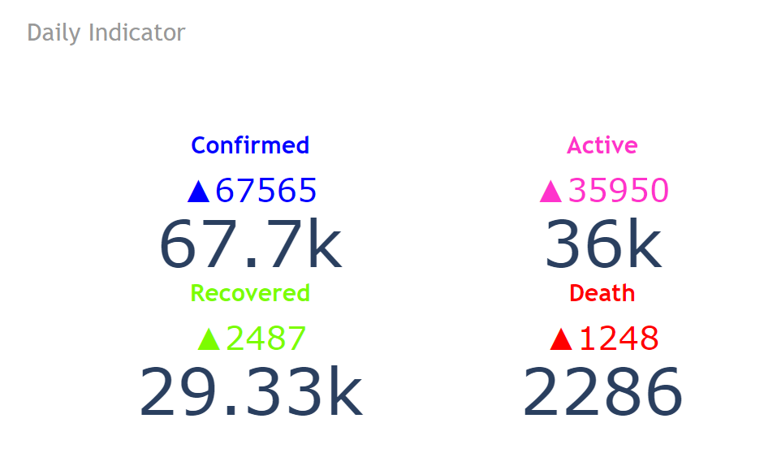
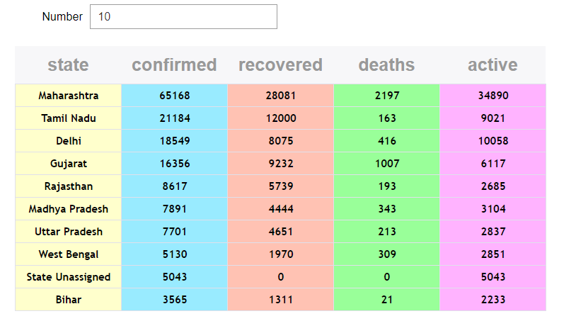
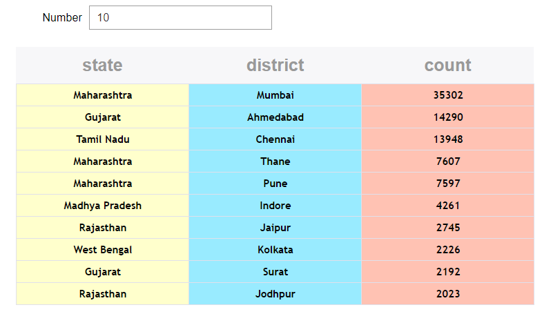
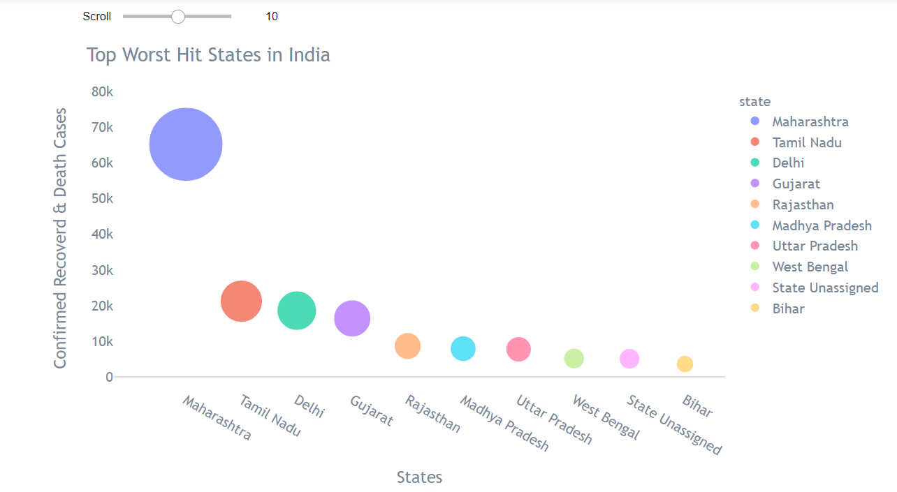
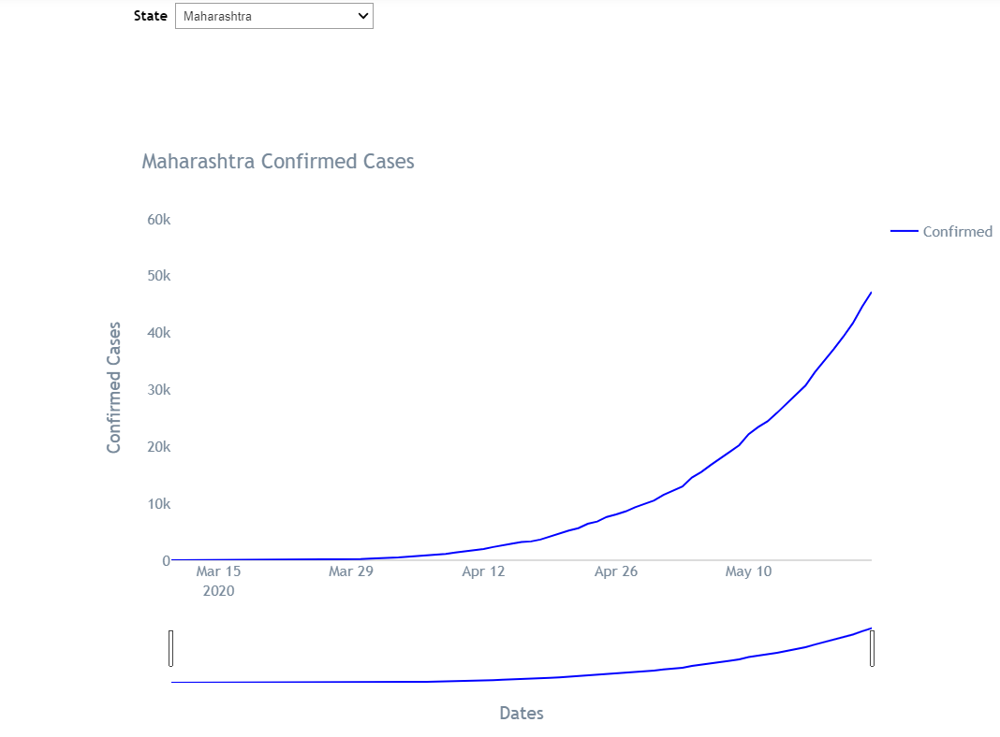

# India COVID-19 Tracker

# Requirements
1. pip install pandas
2. pip install plotly
3. pip install ipywidgets
4. pip install folium
5. pip install voila

# Data Repository 
https://api.covid19india.org/

# OUTPUT

 
